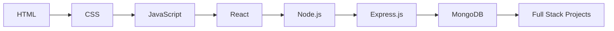

<div align="center">

# 🚀 Web Development


<br>


<br>


</div>

---

# 💫 About

This repository documents my complete journey toward becoming a professional Full Stack Developer.

It contains:

* 📚 Learning Notes
* 💻 Practice Questions
* 🚀 Real World Projects
* 🧠 Problem Solving
* ⚡ Frontend Development
* 🔥 Backend Development
* 🌐 MERN Stack Applications

Every commit represents progress.

---

# 🛠 Tech Arsenal

<div align="center">


</div>

---

# 📂 Repository Architecture

```text
Web-Development
│
├── HTML
├── CSS
├── JavaScript
├── React
├── NodeJS
├── ExpressJS
├── MongoDB
├── SQL
├── Projects
├── Practice
├── Notes
└── README.md
```

---

# 🚀 Learning Roadmap



---

# 📊 GitHub Analytics

<div align="center">


</div>

<br>

<div align="center">


</div>

---

# 🏆 Development Goals

```text
✓ Learn Deeply
✓ Build Consistently
✓ Create Real World Projects
✓ Master MERN Stack
✓ Become Industry Ready
✓ Never Stop Learning
```

---

# 🌟 Philosophy

> Code.
>
> Build.
>
> Break.
>
> Learn.
>
> Repeat.

---

<div align="center">

## ⚡ Building One Commit At A Time


</div>

---

<div align="center">

### ⭐ Star this repository if you like the journey


</div>
