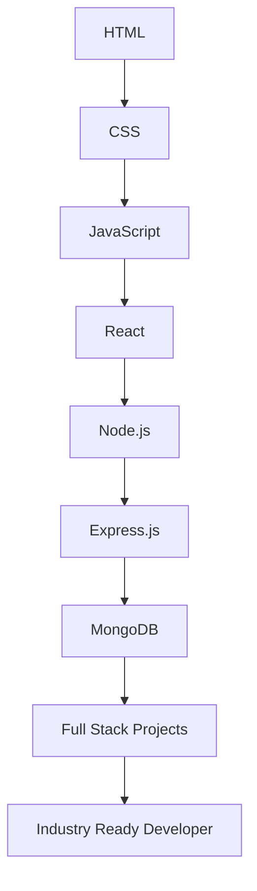

<div align="center">


<br>


<br>


<br><br>


</div>

---

# ⚡ About This Repository

This repository represents my complete journey toward becoming a professional Full Stack Developer.

It serves as a centralized collection of:

- 📚 Learning Notes
- 💻 Practice Questions
- 🚀 Real World Projects
- 🧩 Problem Solving
- 🌐 Frontend Development
- ⚙️ Backend Development
- 🔥 MERN Stack Applications

Every commit reflects continuous learning, experimentation, and growth.

---

# 🛠️ Tech Stack

### Frontend

<p>

</p>

### Backend

<p>

</p>

### Tools

<p>

</p>

---

# 🗺️ Learning Roadmap



---

# 📂 Repository Structure

```bash
Web-Development
│
├── HTML
├── CSS
├── JavaScript
├── React
├── NodeJS
├── ExpressJS
├── MongoDB
├── SQL
├── Projects
├── Practice
├── Notes
└── README.md
```

---

# 🚀 What You'll Find Here

### Frontend Development

- Semantic HTML
- Modern CSS
- Responsive Design
- Flexbox & Grid
- Bootstrap
- Tailwind CSS
- JavaScript ES6+
- React.js

### Backend Development

- Node.js
- Express.js
- REST APIs
- Authentication
- Authorization
- MVC Architecture
- Deployment

### Databases

- MongoDB
- SQL
- Database Design
- Relationships
- Query Optimization

---

# 📊 GitHub Analytics

<div align="center">


</div>

<br>

<div align="center">


</div>

---

# 🏆 Development Philosophy

```text
Learn Deeply
Build Consistently
Stay Curious
Solve Problems
Improve Daily
Never Stop Growing
```

---

# 💡 Motto

> Learn.
>
> Build.
>
> Break.
>
> Fix.
>
> Repeat.

---

# 🔥 Current Focus

```javascript
const developer = {
    name: "Het Patel",
    role: "Aspiring Full Stack Developer",
    stack: ["HTML", "CSS", "JavaScript", "React", "Node.js", "MongoDB"],
    mission: "Build impactful software and become industry ready"
};
```

---

# 🐍 Contribution Snake

<div align="center">


</div>

---

# 😂 Developer Humor

<div align="center">


</div>

---

<div align="center">

## ⭐ Thanks For Visiting

### Building One Commit At A Time 🚀


</div>
