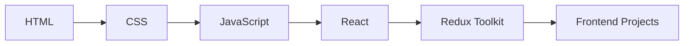
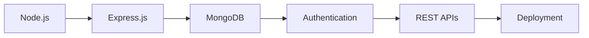

<div align="center">

# 🚀 Web Development Mastery Journey


<br>


</div>

---

# 🎯 Mission

This repository documents my complete transformation from a beginner developer into a professional Full Stack MERN Engineer.

Every concept, project, challenge, note, assignment, and real-world application I build during this journey will be stored here.

This repository is not just code.

It is a record of continuous growth, consistency, problem-solving, and engineering excellence.

---

# 🛣️ Learning Roadmap

## 🌐 Frontend Development



### Topics Covered

✅ HTML5

✅ CSS3

✅ Flexbox

✅ CSS Grid

✅ Responsive Design

✅ Bootstrap

✅ Tailwind CSS

✅ JavaScript ES6+

✅ DOM Manipulation

✅ Async JavaScript

✅ REST APIs

✅ React

✅ Hooks

✅ Redux Toolkit

✅ Material UI

---

## ⚙️ Backend Development



### Topics Covered

✅ Node.js

✅ Express.js

✅ MongoDB

✅ SQL

✅ Mongoose

✅ Authentication

✅ Authorization

✅ Session Management

✅ MVC Architecture

✅ Error Handling

✅ Deployment

---

# 💻 Tech Stack

## Frontend

<p align="left">

</p>

## Backend

<p align="left">

</p>

## Tools

<p align="left">

</p>

---

# 📂 Repository Structure

```bash
Web-Development
│
├── 01_HTML
├── 02_CSS
├── 03_JavaScript
├── 04_React
├── 05_NodeJS
├── 06_ExpressJS
├── 07_MongoDB
├── 08_SQL
├── 09_Projects
├── 10_Practice
├── 11_Notes
└── README.md
```

---

# 📈 Progress Tracker

| Technology | Progress |
|------------|----------|
| HTML | 🟩⬜⬜⬜⬜ |
| CSS | ⬜⬜⬜⬜⬜ |
| JavaScript | ⬜⬜⬜⬜⬜ |
| React | ⬜⬜⬜⬜⬜ |
| Node.js | ⬜⬜⬜⬜⬜ |
| Express.js | ⬜⬜⬜⬜⬜ |
| MongoDB | ⬜⬜⬜⬜⬜ |
| SQL | ⬜⬜⬜⬜⬜ |
| Projects | ⬜⬜⬜⬜⬜ |

---

# 🏆 Milestones

- [ ] Complete HTML
- [ ] Complete CSS
- [ ] Complete JavaScript
- [ ] Complete React
- [ ] Complete Backend
- [ ] Complete MERN Stack
- [ ] Build 25+ Projects
- [ ] Deploy Full Stack Application
- [ ] Open Source Contribution
- [ ] Internship Ready

---

# 🚀 Projects Showcase

| Project | Status |
|----------|---------|
| Portfolio Website | 🔄 |
| Weather App | 🔄 |
| Blog Application | ⏳ |
| Authentication System | ⏳ |
| E-Commerce Platform | ⏳ |
| Full Stack MERN Project | ⏳ |

---

# 📚 Current Learning

```javascript
const developer = {
    name: "Het Patel",
    focus: "Full Stack Web Development",
    currentlyLearning: [
        "HTML",
        "CSS",
        "JavaScript",
        "React",
        "Node.js",
        "MongoDB"
    ],
    goal: "Become Industry Ready Full Stack Engineer"
}
```

---

# 🔥 Learning Philosophy

> Learn → Build → Fail → Improve → Repeat

Consistency beats intensity.

Small progress every day creates extraordinary results over time.

---

# 📊 GitHub Activity

<div align="center">


</div>

---

# 🌟 Final Goal

Build production-ready applications.

Master modern web technologies.

Become a highly skilled Full Stack Developer.

Create impactful software that solves real-world problems.

---

<div align="center">

## ⭐ If you like this journey, consider giving this repository a star.

### Building one commit at a time 🚀

</div>
